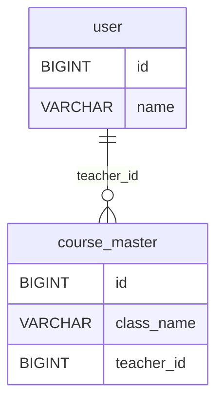

# 🧭 DB 명세서 & ERD 자동화 플랫폼 (멀티-DB 지원)

## 1. 프로젝트 개요

### 🎯 목표
- 여러 데이터베이스의 스키마 정보를 자동으로 읽어 **테이블 명세서**와 **ERD**를 시각적으로 생성.
- 테이블/컬럼의 코멘트를 직접 수정하고, **Excel / Markdown / HTML / PDF** 형태로 문서화.
- 단일 DB가 아니라 **여러 DB(개발, 스테이징, 운영 등)** 를 등록하고, 선택하여 각각의 문서를 생성 및 관리할 수 있도록 함.

### 📌 주요 특징
- **DB 자동 스키마 분석** (테이블, 컬럼, PK, FK, 인덱스, 코멘트)
- **개발자 친화적 ERD** (Mermaid 기반)
- **멀티 DB 프로필 관리(JSON 기반)**
- **문서 자동 내보내기** (Excel, MD, HTML, PDF)
- **스냅샷/버전 관리 및 Diff 리포트** (환경 간 비교)

---

## 2. 시스템 구성도

```
┌───────────────────────────────────────────────┐
│                UI (Streamlit WebApp)          │
│   - DB 선택 (복수 선택 가능)                 │
│   - 스키마 탐색 / 테이블 검색 / 코멘트 수정  │
│   - ERD 미리보기 (Mermaid)                   │
│   - Export (Excel, MD, HTML, PDF)             │
└───────────────────────────────────────────────┘
                │
                ▼
┌───────────────────────────────────────────────┐
│            Introspect Engine (Python)         │
│   - SQLAlchemy Inspector                      │
│   - INFORMATION_SCHEMA 조회                   │
│   - 메타데이터 정규화(JSON)                   │
└───────────────────────────────────────────────┘
                │
                ▼
┌───────────────────────────────────────────────┐
│            Document Generator Layer           │
│   - Mermaid ERD Generator                     │
│   - Jinja2 (HTML/MD Template)                 │
│   - Pandas + Openpyxl (Excel)                 │
│   - WeasyPrint (PDF 변환)                     │
└───────────────────────────────────────────────┘
```

---

## 3. 멀티 DB 관리 설계

### 🔧 DB 프로필 관리(JSON)

```json
{
  "profiles": [
    {
      "id": "academy-dev",
      "label": "Academy DEV",
      "engine": "mysql",
      "url": "mysql+pymysql://user:pw@10.0.1.12:3306",
      "schemas": ["academy", "billing"],
      "tags": ["dev", "academy"]
    },
    {
      "id": "erp-prod",
      "label": "ERP PROD",
      "engine": "mysql",
      "url": "mysql+pymysql://ro_user:pw@rds-prod:3306",
      "schemas": ["academy", "counsel", "materials"],
      "tags": ["prod", "erp"]
    }
  ],
  "options": {
    "defaultInclude": ".*",
    "defaultExclude": "_history$|_backup$",
    "domainPrefixes": ["user_", "course_", "billing_", "counsel_", "materials_"],
    "fetchComments": true,
    "timeoutSeconds": 60
  }
}
```

---

## 4. 주요 기능 명세

| 구분 | 기능 | 설명 |
|------|------|------|
| **1. DB 연결** | 다중 DB 프로필 로드 | JSON 기반 여러 DB 등록 및 선택 |
| **2. 스키마 분석** | SQLAlchemy Inspector 활용 | 테이블/컬럼/PK/FK/인덱스 자동 수집 |
| **3. 코멘트 보정** | 인라인 수정 + 자동 주석 규칙 | `_id → 참조 ID`, `_yn → 여부` 등 자동 생성 |
| **4. ERD 생성** | Mermaid 기반 ER 다이어그램 | `Parent ||--o{ Child : FK` 형식, 도메인 탭 분리 |
| **5. 문서화** | Excel / Markdown / HTML / PDF | 버튼 클릭으로 자동 생성 |
| **6. 멀티 DB Export** | ZIP 일괄 내보내기 | 여러 DB·스키마 결과 묶음 다운로드 |
| **7. 스냅샷 관리** | JSON 저장 / Diff | 시점별 스키마 비교 리포트 |
| **8. 필터링** | Include/Exclude 정규식 | 특정 접두사/패턴 단위 필터 |
| **9. 도메인 분할** | 접두사/그래프 기반 | 도메인별 ERD 생성 및 별도 PDF 출력 |

---

## 5. ERD 생성 방식

### 🧱 Mermaid ERD (기본)


### 🌐 Cytoscape.js (확장)
- 대규모 스키마에서 팬/줌 가능한 상호작용 ERD.
- FK 기반 그래프 구조로 탐색 가능.

### 🖨️ Graphviz SVG (PDF용)
- A3 포스터 수준의 고품질 레이아웃.
- PDF 출력 시 ERD를 개별 페이지로 삽입 가능.

---

## 6. UI 및 UX 설계

1. **대시보드**: 여러 DB 프로필 리스트, 검색, 태그 필터, 선택
2. **스키마 뷰어**: 좌측(테이블 목록), 중앙(ERD), 우측(컬럼/코멘트 편집)
3. **문서화 패널**: Excel/MD/HTML/PDF Export 버튼
4. **스냅샷 & Diff**: 버전별 비교, 변경 리포트 표시

---

## 7. 문서 산출물 구조

### 📘 Excel
- TableSpec, Relations, Indexes 시트 분리

### 📄 Markdown
- 스키마 개요 → ERD → 테이블 상세

### 🌐 HTML
- Mermaid.js 임베드 + 검색/필터 기능

### 📑 PDF
- HTML 기반 변환, ERD 포함

---

## 8. 편의 기능 및 개선 아이디어

| 분류 | 내용 |
|------|------|
| 자동 코멘트 생성기 | 컬럼명 규칙 기반 한글 코멘트 자동 생성 |
| 컬럼 강조 | PK Bold, FK 색상 표시 |
| 검색 UX 개선 | 자동완성 + 히스토리 |
| 도메인 분할 | 접두사 기반 + FK 그래프 |
| 버전 메타 | 생성일시/DB/스키마/필터 기록 |
| ZIP Export | 다중 DB 문서 묶음 |
| Diff Report | 환경 간 스키마 비교 |

---

## 9. 기술 스택

| 구성 | 기술 | 비고 |
|------|------|------|
| DB 커넥션 | SQLAlchemy | 다중 DB 지원 |
| 프레임워크 | Streamlit | 빠른 UI 구현 |
| 템플릿 | Jinja2 | HTML/MD 생성 |
| Excel | Pandas + Openpyxl | 스타일 지정 |
| PDF | WeasyPrint | HTML → PDF |
| ERD | Mermaid / Cytoscape / Graphviz | 시각화 |
| 설정 관리 | JSON | 멀티 DB 프로필 |
| 버전 관리 | Git / JSON | Diff/비교 |

---

## 10. 성능 및 보안 정책

| 항목 | 내용 |
|------|------|
| 성능 목표 | 500+ 테이블 기준 1분 이내 처리 |
| DB 접근 정책 | Read-only 계정 사용 |
| 비밀정보 보호 | .env / Vault / KMS |
| 실행 로그 | profileId, schema, timestamp |
| 예외 처리 | 커넥션 실패 시 재시도 |

---

## 11. 향후 확장 계획

| 버전 | 기능 |
|------|------|
| v1.0 | 단일/멀티 DB 문서화, ERD, Export |
| v1.1 | 스냅샷 + Diff, 자동 코멘트 |
| v1.2 | Cytoscape 인터랙티브 ERD |
| v1.3 | Oracle/PostgreSQL/MSSQL 지원 |
| v2.0 | FastAPI + Vue 확장 |

---

## 12. 디렉터리 구조

```
project-root/
 ├─ config/db_profiles.json
 ├─ src/connectors/
 ├─ src/introspect/
 ├─ src/generators/
 ├─ src/ui/
 ├─ output/
 ├─ snapshots/
 ├─ requirements.txt
 └─ README.md
```

---

## 13. 일정 (예시)

| 주차 | 목표 |
|------|------|
| 1주차 | JSON 로더 + 스키마 분석 |
| 2주차 | UI 구축 + Export |
| 3주차 | 스냅샷 + Diff |
| 4주차 | 성능/보안 최적화 |

---

## 14. 수용 기준 (Acceptance Criteria)

- [x] 멀티 DB 프로필 로드/선택  
- [x] 스키마 분석 및 ERD 생성  
- [x] Excel/MD/HTML/PDF Export  
- [x] 코멘트 편집 반영  
- [x] ZIP 묶음 다운로드  
- [x] ERD 도메인 분할 적용  
- [x] 300+ 테이블 기준 60초 내 처리  

---

## 15. 핵심 가치

> “DB 설계 문서를 자동화하고,  
>  여러 환경의 스키마를 한눈에 비교할 수 있는  
>  개발자 친화적 도구”
